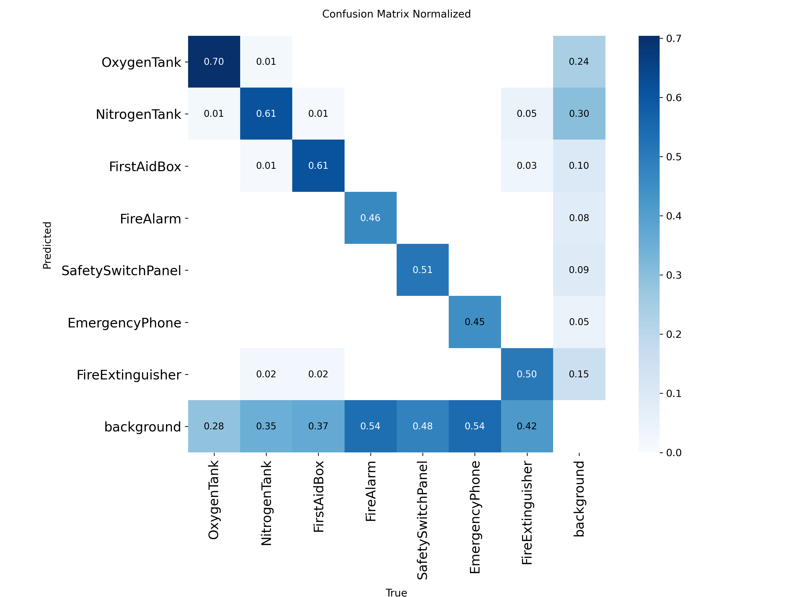

# Duality AI Space: Object Detection using YOLOv8

This project demonstrates an end-to-end pipeline for training, evaluating, and deploying a **YOLOv8 object detection model**. The system detects industrial and safety objects like **Oxygen Tanks, Fire Alarms, Emergency Phones, Fire Extinguishers, First Aid Boxes, and Safety Switch Panels**.

---

## 🔗 Live Demos

- **Hugging Face Space (Backend + API + Gradio UI):**  
  👉 [HackwithHyd on Hugging Face](https://huggingface.co/spaces/nikethanreddy/HackwithHyd)

- **Frontend (Attractive Web UI on GitHub Pages):**  
  👉 [Hack-with-Hyderabad 2025](https://sreenikethanreddy.github.io/Hack-with-hyderabad-2025/)

---

## 📊 Model Performance
**mAP@0.5: 0.7443649691053726**

**mAP@0.5:0.95: 0.6131248743275334**

**Precision: 0.8835241502442965**

**Recall: 0.6648288815906493**

Confusion Matrix (Normalized):  



---

## 🛠️ Tech Stack

### **Model Training**
- YOLOv8 (Ultralytics)  
- PyTorch  
- Google Colab (for training & testing)  

### **Evaluation**
- Metrics: mAP@0.5, mAP@0.5:0.95, Precision, Recall  
- Confusion Matrix visualization  

### **Deployment**
- Hugging Face Spaces (Gradio + Python backend)  
- GitHub Pages (Frontend website with Gradio client calls)  

### **Frontend**
- HTML, CSS, JavaScript  
- Hugging Face `@gradio/client`  

---

## 🚀 How to Use

### 1. **Testing the Trained Model in Colab**
To test the trained YOLOv8 model locally or in Colab:
1. Place the `best.pt` file in the same directory as your `Hackwithhydtest.ipynb` notebook.  
2. Open the notebook.  
3. In the cell where the model is loaded, update the path:  
   ```python
   from ultralytics import YOLO

   # Load trained model
   
   model = YOLO("best.pt")

   # Run inference
   results = model.predict("path/to/test/images", save=True)
   results.show()
---
## Sample outputs
